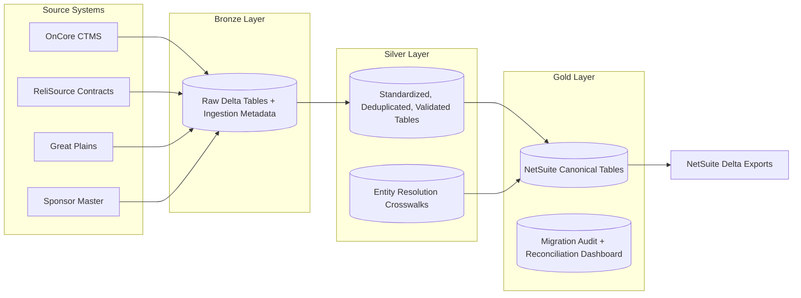

# Clinical Trial Data Migration Lakehouse

An end-to-end Databricks + Delta Lake project that migrates fragmented clinical trial operations and finance data into a unified, NetSuite-ready model.

## 1) Business problem
Clinical research organizations often run critical workflows across disconnected systems. Study operations teams, contract teams, and finance teams each maintain their own records, which creates frequent cross-system issues:
- studies cannot be reliably tied to active contracts,
- sponsor hierarchies differ by source,
- invoice and AR balances are hard to reconcile against protocol activity,
- downstream ERP loads require manual data cleanup.

This project demonstrates a practical migration pattern to consolidate those systems into an auditable lakehouse pipeline with traceable transformations, incremental processing, and export-ready target tables.

## 2) Source systems explanation
The pipeline ingests four source domains:
- **OnCore CTMS**: study lifecycle and site operations (study, protocol, site, investigator).
- **ReliSource Contracts**: contract administration (contracts, amendments, values, status).
- **Great Plains**: financial transactions (invoices, paid amounts, open AR).
- **Sponsor Master**: sponsor reference hierarchy and billing account mappings.

Core linking fields across systems include `sponsor_external_id`, `protocol_no`, `study_name`, `contract_name`, and `site_code`.

## 3) Clinical trial data relationships
At a high level:
- A **Sponsor** funds one or more **Studies**.
- A **Study** is governed by a **Protocol** and can run at multiple **Sites**.
- A **Contract** is established for study work (and may be amended over time).
- **Invoices** are billed against contracts/protocol activity.
- **Open AR** is calculated from invoice amount minus paid amount.

These relationships are not always clean in source systems, so the pipeline applies standardization + entity resolution before producing canonical Gold outputs.

## 4) Architecture diagram (Mermaid)


## 5) Medallion architecture explanation
### Bronze
- Reads batch files from `data/sample_source/{system}/batch_date=YYYY-MM-DD/`.
- Preserves raw source columns.
- Adds ingestion metadata (`source_system`, `source_file_name`, `ingestion_timestamp`, `load_id`, `batch_date`, `record_hash`).
- Writes raw Delta tables using Unity Catalog-style naming.

### Silver
- Standardizes types and formatting (text normalization, date parsing, currency normalization).
- Applies quality checks and sends invalid records to quarantine tables.
- Deduplicates by business keys.
- Builds conformed entities (`silver_study`, `silver_contract`, `silver_invoice`, `silver_sponsor`, `silver_site`) and resolution crosswalks.

### Gold
- Produces NetSuite-oriented canonical outputs for customer, project, contract, invoice, and open AR.
- Generates migration audit summaries and reconciliation outputs for operational monitoring.

## 6) Incremental load strategy
The incremental framework uses record-level hashes and Delta merge semantics:
1. Generate deterministic `record_hash` from business-relevant fields.
2. Compare incoming vs current state to classify `insert`, `update`, `delete`, `no_change`.
3. Apply Delta `MERGE` into current Silver/Gold tables.
4. Maintain SCD Type 2-style history for sponsor, study, and contract entities.
5. Generate per-batch NetSuite delta exports under:
   - `exports/netsuite/customer_delta/`
   - `exports/netsuite/project_delta/`
   - `exports/netsuite/contract_delta/`
   - `exports/netsuite/invoice_delta/`
   - `exports/netsuite/open_ar_delta/`

## 7) Entity matching strategy
Entity resolution follows a deterministic-first hierarchy:
1. exact `sponsor_external_id`
2. exact `protocol_no`
3. normalized exact `contract_name`
4. normalized exact `study_name`
5. fuzzy fallback for sponsor/contract naming variation

The model emits:
- `sponsor_match_score`
- `study_match_score`
- `contract_match_score`
- `overall_match_confidence`

Output crosswalks:
- `silver_entity_crosswalk`
- `silver_sponsor_crosswalk`
- `silver_study_contract_crosswalk`

## 8) NetSuite target model
Canonical Gold outputs:
- `gold_netsuite_customer_master` (Sponsor -> NetSuite Customer)
- `gold_netsuite_project_master` (Study/Protocol -> NetSuite Project)
- `gold_netsuite_contract_master` (ReliSource Contract -> NetSuite Contract)
- `gold_netsuite_invoice_header` (Great Plains invoice header)
- `gold_netsuite_invoice_line` (invoice line-level representation)
- `gold_netsuite_open_ar` (outstanding balances)
- `gold_migration_audit_summary` (load and migration observability)

Detailed field-level mapping reference: `docs/source_to_target_mapping.md`.

## 9) Data quality and reconciliation
### Data quality checks (examples)
- `protocol_no` required for study records.
- `sponsor_external_id` required where applicable.
- `invoice_amount >= paid_amount`.
- `outstanding_amount = invoice_amount - paid_amount`.
- `contract_value > 0`.

### Reconciliation metrics
- source vs target record counts,
- contract value source vs target,
- invoice totals source vs target,
- open AR totals source vs target,
- rejected and duplicate counts,
- match accuracy,
- load runtime,
- insert/update/delete counts.

See `docs/reconciliation_framework.md` and `notebooks/07_reconciliation_dashboard.ipynb`.

## 10) How to run locally
### Prerequisites
- Python 3.10+
- Java 8/11+ (for PySpark)

### Steps
```bash
python -m venv .venv
source .venv/bin/activate
pip install -U pip pytest pyspark delta-spark
python scripts/generate_mock_data.py
PYTHONPATH=src:. pytest -q
```

To execute pipeline components locally, run notebook-style scripts as Python modules in sequence (Spark environment required):
1. `notebooks/01_bronze_ingestion.py`
2. `notebooks/02_silver_conformance.py`
3. `notebooks/04_entity_resolution.py`
4. `notebooks/03_gold_netsuite_export.py`
5. `notebooks/06_delta_load_processing.ipynb`
6. `notebooks/07_reconciliation_dashboard.ipynb`

## 11) How to run on Databricks
### Notebook execution path
- Import notebooks from `/notebooks` into a Databricks workspace.
- Attach to a cluster with Delta Lake support.
- Execute notebooks in pipeline order (Bronze -> Silver -> Entity Resolution -> Gold -> Delta Processing -> Reconciliation).

### Databricks Asset Bundles path
Project assets are in:
- `resources/databricks.yml`
- `resources/jobs.yml`
- `resources/permissions.yml`
- `resources/config/{dev,test,prod}.yml`
- `resources/env/.env.example`

Typical flow:
```bash
databricks bundle validate
databricks bundle deploy -t dev
databricks bundle run clinical_migration_pipeline -t dev
```

## 12) Bullet examples
- Built a multi-source Databricks lakehouse pipeline that unifies clinical operations and financial systems into NetSuite-ready canonical datasets.
- Implemented hash-based incremental merge logic with SCD2 history patterns to support controlled inserts, updates, deletes, and repeatable delta exports.
- Designed deterministic + fuzzy entity resolution across sponsor, study, protocol, and contract records with confidence scoring and measurable accuracy.
- Added auditable data quality gates, quarantine handling, and reconciliation reporting to validate migration completeness and financial alignment.

## 13) Architecture decisions
- **PySpark-first implementation** for scalable transformations and Databricks-native execution.
- **Delta Lake + MERGE patterns** for ACID guarantees and incremental upsert support.
- **Medallion layering** to separate raw ingestion from conformance and business consumption.
- **Unity Catalog-style naming** to support governance-ready table organization.
- **Deterministic matching before fuzzy logic** to maximize precision and explainability.
- **Quarantine strategy** to isolate bad records without blocking valid data movement.

## 14) Future enhancements
- Add schema registry + explicit schema evolution controls per source feed.
- Introduce CDC connectors for near-real-time source capture.
- Add expectation frameworks (for example Great Expectations/Deequ) with SLA alerting.
- Expand fuzzy matching with phonetic encodings + vector similarity.
- Add contract milestone and revenue recognition logic to Gold finance models.
- Add orchestration observability (lineage, alerting, cost/perf dashboards).

---

## Repository map
```text
.
├── architecture/
├── data/sample_source/
├── docs/
├── notebooks/
├── resources/
├── scripts/
├── src/clinical_lakehouse/
└── tests/
```
